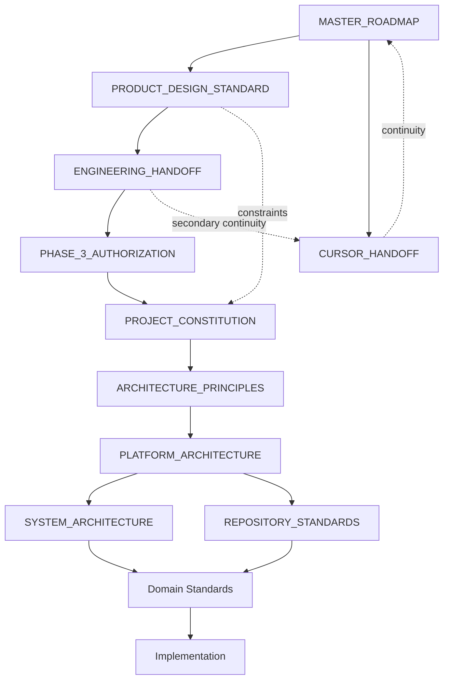

# Rento Repository Standards

**Status:** PUBLISHED — Phase 3.5 Repository Standards  
**Authority class:** Authoritative repository governance  
**Audience:** Engineering Architecture Program, Documentation Governance Board, Design Council, Contributors  
**Governance basis:** PROJECT_CONSTITUTION.md · ARCHITECTURE_PRINCIPLES.md · PLATFORM_ARCHITECTURE.md · ENGINEERING_HANDOFF.md · PHASE_3_AUTHORIZATION.md · RENTO PRODUCT DESIGN STANDARD v1.0 (GD-016)  

---

## 1. Document Purpose

This document defines **how the Rento engineering repository is organized and governed**.

It answers:

- How is the repository structured at the documentation and governance level?
- Which document owns which responsibility?
- How are engineering standards added to the repository?
- How are architecture documents versioned?
- How is traceability preserved across sessions, phases, and contributors?
- How are authority relationships represented in the repository?
- How are future standards integrated without authority drift?

This document governs **repository structure and documentation governance**. It does **not** govern implementation.

**Repository is the single source of truth.** Chat memory, issue comments, and tool configuration are not authority.

---

## 2. Authority Position

### 2.1 Position in engineering hierarchy

Repository governance and system structure are **separate responsibility paths** under Platform Architecture. Repository Standards does not inherit system structure from System Architecture.

```
Strategic governance (MASTER_ROADMAP.md)
    → Product governance (RENTO PRODUCT DESIGN STANDARD v1.0)
        → Constitutional engineering authority (PROJECT_CONSTITUTION.md)
            → Engineering principles (ARCHITECTURE_PRINCIPLES.md)
                → Platform architecture (PLATFORM_ARCHITECTURE.md)
                    ├── System architecture (SYSTEM_ARCHITECTURE.md) — Phase 3.4; system structure; not yet published
                    └── Repository standards (this document) — Phase 3.5; repository governance; separate path
                            → Domain engineering standards (when published)
                                → Implementation artifacts
```

### 2.2 Responsibility boundary

| Document | Responsibility | Relationship to this document |
|----------|----------------|------------------------------|
| `SYSTEM_ARCHITECTURE.md` | System-level structural design | Peer path — owns system structure, not repository governance |
| `REPOSITORY_STANDARDS.md` (this document) | Repository governance, documentation taxonomy, traceability | Peer path — owns repository organization, not system structure |

System Architecture retains full authority over system structure. This document does not redefine, subsume, or depend on System Architecture content for repository governance.

### 2.3 What this document owns

- Repository philosophy and documentation taxonomy;
- Directory ownership for governance surfaces;
- Repository-level authority hierarchy representation;
- Document lifecycle, naming, versioning, and traceability discipline;
- Publication, review, deprecation, and evolution rules for repository documents;
- Integration rules for future engineering standards.

### 2.4 What this document does not own

- Product meaning, experience principles, or Product Design Standard content;
- Constitutional governance gates (PROJECT_CONSTITUTION.md);
- General architectural principles (ARCHITECTURE_PRINCIPLES.md);
- Platform domain structure (PLATFORM_ARCHITECTURE.md);
- System structural design (SYSTEM_ARCHITECTURE.md);
- Backend, frontend, API, database, security, infrastructure, or development implementation standards;
- Source code layout, build systems, CI/CD, deployment, or coding conventions;
- Product Development Methodology (Phase 4).

### 2.5 Amendment

This document may be amended only through explicit governance review. Amendments must preserve product authority supremacy, constitutional compliance, and extension-not-replacement discipline. Document-local amendments are recorded in this document's version history unless they materially affect repository-wide governance (see §5.4).

---

## 3. Repository Philosophy

### 3.1 Single source of truth

The repository is the **only durable authority surface** for Rento governance.

A governance decision, standard, or architectural commitment is not binding until it is:

1. Authored in the correct repository location;
2. Placed at the correct authority level;
3. Recorded with honest document lifecycle status;
4. Approved and published per §7.6;
5. Integrated into continuity records where required;
6. Traceable to governance basis via git checkpoint or governance artifact.

### 3.2 Layered authority

The repository organizes authority in **separable layers**. Each layer has one primary role. Layers must not absorb one another's authority.

| Layer | Function |
|-------|----------|
| Strategic | Phase order, program boundaries, major governance transitions |
| Product | Product meaning and experience authority |
| Handoff & authorization | Transfer state, gates, permitted work |
| Constitutional | Enduring engineering program boundaries |
| Principles | Structural engineering thinking discipline |
| Architecture | Platform and system structural design |
| Repository governance | Documentation organization and traceability (this document) |
| Domain standards | Domain-specific engineering constraints |
| Operational continuity | Current checkpoint and next authorized step |
| Operational encoding | Executable constraint mirrors (subordinate) |
| Implementation | Code and runtime artifacts (subordinate) |

### 3.3 Repository-native governance

Governance lives in documents, not in oral tradition, chat pins, or transient tool state.

Every contributor must be able to initialize understanding from repository documentation alone (GD-002).

### 3.4 Extension, not replacement

Repository evolution adds capability through governed extension. Silent replacement of approved authority documents is prohibited (Chapter 58 Continuous Architectural Lineage; EP-2; AP-8).

### 3.5 Honest completion

Distinct completion levels must never be conflated:

| Level | Does NOT imply |
|-------|----------------|
| Program authorization | Document approved or binding |
| Document authored | Document approved |
| Document approved | Document published or active authority |
| Engineering foundation published | Phase 3 complete |
| Phase 3 complete | Implementation authorized |
| Implementation exists | Product meaning redefined |

### 3.6 Technology neutrality

Repository governance is **implementation-neutral**. Technology choices belong in subordinate domain standards or implementation artifacts — not in repository governance authority.

---

## 4. Document Taxonomy

Every repository document belongs to exactly one **primary document class**. A document may hold **secondary roles** that support continuity or traceability — secondary roles do not create competing primary authority identities.

### 4.1 Strategic documents

| Class | Path pattern | Role |
|-------|--------------|------|
| Master roadmap | `docs/design/MASTER_ROADMAP.md` | Highest-level phase order and strategic governance decisions |

### 4.2 Product authority documents

| Class | Path pattern | Role |
|-------|--------------|------|
| Product Design Standard | `docs/design/RENTO_PRODUCT_DESIGN_STANDARD.md` | Highest authority for product decisions |
| Product release manifest | `docs/design/releases/v1.0-*.md` | Freeze, certification, and macro-domain milestone lineage |

### 4.3 Transfer and authorization documents

| Class | Path pattern | Role |
|-------|--------------|------|
| Engineering handoff | `docs/design/ENGINEERING_HANDOFF.md` | Product-to-engineering transfer manifest |
| Phase authorization | `docs/design/PHASE_*_AUTHORIZATION.md` | Program gate records |
| Phase 0 analysis | `docs/design/PHASE_0_*.md`, `docs/design/PHASE_1_*.md` | Pre-authoring analysis — not final authority |

**Secondary role:** `ENGINEERING_HANDOFF.md` also serves as an engineering session initialization reference. This continuity role does not make it a continuity authority document or grant it normative governance content authority.

### 4.4 Engineering foundation documents

| Class | Path pattern | Role |
|-------|--------------|------|
| Constitution | `docs/engineering/PROJECT_CONSTITUTION.md` | Highest engineering authority |
| Architecture principles | `docs/engineering/ARCHITECTURE_PRINCIPLES.md` | Structural engineering principles |
| Platform architecture | `docs/engineering/PLATFORM_ARCHITECTURE.md` | Platform domain structure |
| System architecture | `docs/engineering/SYSTEM_ARCHITECTURE.md` | System-level structure (when published) |
| Repository standards | `docs/engineering/REPOSITORY_STANDARDS.md` | Repository governance (this document) |
| Domain standards | `docs/engineering/*_STANDARDS.md`, `docs/engineering/*_ARCHITECTURE.md` | Domain engineering standards (when published) |

### 4.5 Continuity documents

| Class | Path pattern | Role |
|-------|--------------|------|
| Cursor handoff | `docs/design/CURSOR_HANDOFF.md` | Operational session continuity |

Continuity documents record state. They do not create normative authority.

### 4.6 Governance evidence documents

| Class | Path pattern | Role |
|-------|--------------|------|
| Audit charter | `docs/design/PHASE_0_ARCHITECTURAL_AUDIT.md` | Audit scope and completion record |
| Findings register | `docs/design/AUDIT_FINDINGS_REGISTER.md` | Official findings disposition |
| Governance decisions | `docs/design/MASTER_ROADMAP.md` §Governance Decisions | Strategic decision log |

### 4.7 Historical and draft documents

| Class | Path pattern | Role |
|-------|--------------|------|
| Chapter drafts | `docs/design/drafts/CHAPTER_*.md` | Superseded authoring artifacts — not authority |
| Legacy documents | `docs/ARCHITECTURE.md`, `docs/ROADMAP.md`, `docs/PRODUCT_DECISIONS.md` | Subordinate — inform only |

### 4.8 Operational encoding

| Class | Path pattern | Role |
|-------|--------------|------|
| Cursor rules | `.cursor/rules/*.mdc` | Operational constraint encoding — subordinate to repository authority |
| Cursor skills | `.cursor/skills/**/SKILL.md` | Tool-assisted workflow guidance — subordinate |

### 4.9 Implementation artifacts

| Class | Path pattern | Role |
|-------|--------------|------|
| Application source | `backend/`, `frontend/` | Runtime realization — subordinate to approved standards |
| Infrastructure config | deployment-related paths | Operational realization — subordinate |

**Rule:** A document's primary class determines its authority level. Secondary roles must be declared explicitly and must not compete with the primary class. Misclassified documents must be rerouted, not reinterpreted.

---

## 5. Directory Ownership

### 5.1 Ownership model

Each top-level repository area has a **documentation owner** responsible for authority placement — not for implementation decisions.

| Directory | Owner | Governs |
|-----------|-------|---------|
| `docs/design/` | Product Design Program / Documentation Governance Board | Product authority, strategic governance, handoff, releases, Phase 0 artifacts |
| `docs/engineering/` | Engineering Architecture Program | Engineering standards and architecture documents |
| `docs/` (root-level legacy) | Documentation Governance Board | Subordinate legacy references only — no new authority |
| `docs/design/drafts/` | Authoring workflow | Historical drafts — never authority |
| `docs/design/releases/` | Documentation Governance Board | Release and freeze manifests |
| `.cursor/rules/` | Engineering Leadership | Operational encoding of binding constraints |
| `backend/`, `frontend/` | Implementation teams | Source code — subordinate to approved standards |

### 5.2 Placement rules

| Content type | Required location |
|--------------|-------------------|
| New product authority | `docs/design/RENTO_PRODUCT_DESIGN_STANDARD.md` (via governed product evolution only) |
| New engineering standard | `docs/engineering/` |
| Strategic governance decision | `docs/design/MASTER_ROADMAP.md` §Governance Decisions (see §5.4) |
| New Phase 0 analysis | `docs/design/PHASE_0_*.md` or `PHASE_1_*.md` |
| New release manifest | `docs/design/releases/` |
| Session continuity update | `docs/design/CURSOR_HANDOFF.md` |
| Implementation code | `backend/` or `frontend/` — never `docs/` |

### 5.3 Prohibited placements

- Binding product authority in `.cursor/rules/` or implementation directories;
- Binding engineering standards in `docs/design/drafts/`;
- Constitutional authority in domain standards;
- Implementation conventions in repository governance documents;
- New authoritative concepts in `docs/PRODUCT_DECISIONS.md` without upstream ownership.

### 5.4 Governance decision routing

`MASTER_ROADMAP.md` is strategic governance. It receives **only** decisions that affect:

- Strategic phase order;
- Phase status;
- Program authorization;
- Repository-wide authority hierarchy;
- Major governance transitions;
- Major program milestones.

**Document-local matters** remain in the owning document unless they materially affect repository-wide governance:

| Matter | Record location |
|--------|-----------------|
| Amendments, clarifications, version history | Owning document |
| Deprecation and supersession lineage | Successor and deprecated documents |
| Document-local review outcomes | Owning document or review record |
| Continuity checkpoint updates | `CURSOR_HANDOFF.md` |
| Phase step completion within an authorized program | `MASTER_ROADMAP.md` phase table when materially affects program status |

`MASTER_ROADMAP.md` must not become an operational log for every document amendment.

---

## 6. Authority Hierarchy

### 6.1 Full repository authority order

For **product decisions**:

```
Immutable domain rules (distributed product architecture)
    → RENTO PRODUCT DESIGN STANDARD v1.0
        → pattern specifications
            → Chapter 5 Exception Policy
```

For **engineering decisions**:

```
Strategic governance (MASTER_ROADMAP.md)
    → Product governance (for product-meaning constraints)
        → PROJECT_CONSTITUTION.md
            → ARCHITECTURE_PRINCIPLES.md
                → PLATFORM_ARCHITECTURE.md
                    ├── SYSTEM_ARCHITECTURE.md (when published) — system structure
                    └── REPOSITORY_STANDARDS.md (this document, when published) — repository governance
                        → domain engineering standards
                            → implementation artifacts
```

For **session initialization** (GD-002, extended for engineering):

1. `docs/design/MASTER_ROADMAP.md`
2. `docs/design/RENTO_PRODUCT_DESIGN_STANDARD.md`
3. `docs/design/CURSOR_HANDOFF.md`
4. `docs/design/ENGINEERING_HANDOFF.md` (when accepting engineering work)
5. `docs/design/PHASE_3_AUTHORIZATION.md` (when continuing Phase 3)
6. Engineering foundation documents in hierarchy order
7. This document (when working on repository governance or adding standards)

### 6.2 Non-authoritative sources

The following **inform** work but **cannot override** repository authority:

| Source | Status |
|--------|--------|
| `docs/ARCHITECTURE.md` | Pre-Phase-3 implementation notes — subordinate |
| `docs/ROADMAP.md` | Subordinate to `MASTER_ROADMAP.md` |
| `docs/PRODUCT_DECISIONS.md` | Partial decision log — supporting only |
| `.cursor/rules/rento-phases.mdc` | Implementation phase tracker — numbering differs from MASTER_ROADMAP |
| `docs/design/drafts/` | Historical — superseded |
| Chat transcripts and session memory | Never authority (GD-002) |

### 6.3 Conflict resolution

| Conflict | Resolution |
|----------|------------|
| Product vs engineering | Product authority prevails |
| Constitution vs domain standard | Constitution prevails |
| Repository standards vs domain standard (on repository matters) | Repository standards prevail (when published) |
| Approved document vs draft/legacy | Approved prevails |
| Repository vs conversation | Repository prevails |

Unresolved conflicts require explicit governance review. Silent override is prohibited.

---

## 7. Document Lifecycle

### 7.1 Lifecycle vocabulary

Use one coherent vocabulary. Terms are not interchangeable.

| Term | Scope | Meaning |
|------|-------|---------|
| **AUTHORIZED** (program) | Program gate (`PHASE_*_AUTHORIZATION.md`) | Governance act permits authoring within defined scope — does not approve document content |
| **DRAFT** | Document | Authored content under review — not binding |
| **REVIEW CANDIDATE** | Document | Submitted for independent review — not binding |
| **APPROVED** | Document | Independent review passed; content approved for publication integration — not yet binding as active authority |
| **PUBLISHED** | Document | Integrated into repository with completed publication checkpoint — binding integration complete |
| **ACTIVE AUTHORITY** | Document | Downstream documents and contributors may consume as binding repository governance |
| **COMPLETE** | Program or macro-domain | Declared finished per governance criteria — distinct from document publication |
| **FROZEN** | Document | Content locked against casual modification (e.g., Product Design Standard v1.0) |
| **SUPERSEDED** | Document | Replaced by newer authority — retained for lineage |
| **DEPRECATED** | Document | Discontinued — retained for historical reference only |

**Distinction (mandatory):** Program **AUTHORIZED** ≠ document **APPROVED** ≠ document **PUBLISHED** ≠ **ACTIVE AUTHORITY**.

### 7.2 Pre-publication status

Until the binding-authority transition (§7.6) is complete, an engineering authority document is **not** active repository governance regardless of program authorization to author.

### 7.3 Product document lifecycle (reference)

Product Design Standard documents follow the Macro-domain Development Lifecycle (GD-007):

```
Repository Initialization
    → Phase 0 Pre-Authoring Analysis
    → Design Council Review
    → Phase 1 Authoring (per chapter)
    → Phase 2 Architecture Review
    → Phase 3 Approval Integration
    → Git Checkpoint (per approval)
    → Macro-domain Completion Review (when applicable)
    → Governance Decision + Release (when applicable)
```

Engineering repository governance **honors** this lifecycle for product documents. It does not redefine it.

### 7.4 Engineering document lifecycle

```
Prerequisite verification
    → Program authorization check (PHASE_3_AUTHORIZATION.md or successor)
    → Authored DRAFT at correct path
    → Independent review
    → Review outcome: APPROVED or REQUIRES REVISION
    → Approval integration
    → Publication checkpoint (§7.6)
    → Continuity synchronization (CURSOR_HANDOFF; MASTER_ROADMAP when program status affected)
```

### 7.5 Separate governance acts

The following are **distinct acts**. None implies another:

| Act | Record | Confers binding authority? |
|-----|--------|---------------------------|
| Program authorization | `PHASE_*_AUTHORIZATION.md` | No — permits authoring only |
| Transfer | `ENGINEERING_HANDOFF.md` | No — transfer manifest only |
| Authorship | Document creation in repository | No — creates DRAFT only |
| Independent review | Review record | No — produces APPROVED or REQUIRES REVISION |
| Approval integration | Status transition to APPROVED | No — prepares for publication |
| Publication | §7.6 checkpoint | Yes — confers ACTIVE AUTHORITY |
| Implementation authorization | Separate act — not defined here | Per explicit scope only |

### 7.6 Binding-authority transition

An engineering authority document becomes **ACTIVE AUTHORITY** only when **all** steps below are complete:

| Step | Requirement |
|------|-------------|
| 1 | Program authorization covers the document domain |
| 2 | Upstream prerequisites for the document's responsibility path exist in repository |
| 3 | Independent review returns **APPROVED** (not REQUIRES REVISION) |
| 4 | Approval integration updates document status to **APPROVED** |
| 5 | Publication integration updates document status to **PUBLISHED** |
| 6 | Git checkpoint recorded with traceable publication message |
| 7 | `CURSOR_HANDOFF.md` updated with checkpoint and next authorized step |
| 8 | `MASTER_ROADMAP.md` updated **only if** phase or program status is materially affected (§5.4) |

**Downstream consumption rule:** Domain engineering standards and implementation artifacts may cite an engineering authority document as binding **only after** step 5 completes. Draft, review-candidate, and approved-but-unpublished documents may be referenced for orientation only.

### 7.7 Integration requirements

When an engineering document completes publication:

1. Document status block updated to **PUBLISHED**;
2. `CURSOR_HANDOFF.md` updated with checkpoint and next step;
3. `MASTER_ROADMAP.md` updated only when §5.4 routing applies;
4. Git checkpoint recorded with traceable message;
5. Upstream documents referenced — not duplicated.

---

## 8. Naming Conventions

### 8.1 Engineering standards documents

| Pattern | Use |
|---------|-----|
| `PROJECT_CONSTITUTION.md` | Constitutional authority |
| `ARCHITECTURE_PRINCIPLES.md` | Principles authority |
| `PLATFORM_ARCHITECTURE.md` | Platform architecture |
| `SYSTEM_ARCHITECTURE.md` | System architecture |
| `REPOSITORY_STANDARDS.md` | Repository governance |
| `{DOMAIN}_STANDARDS.md` | Domain standards (e.g., `API_STANDARDS.md`) |
| `{DOMAIN}_ARCHITECTURE.md` | Domain architecture where distinct from standards |

### 8.2 Design program documents

| Pattern | Use |
|---------|-----|
| `MASTER_ROADMAP.md` | Strategic governance |
| `RENTO_PRODUCT_DESIGN_STANDARD.md` | Product authority |
| `CURSOR_HANDOFF.md` | Operational continuity |
| `ENGINEERING_HANDOFF.md` | Engineering transfer |
| `PHASE_{N}_AUTHORIZATION.md` | Authorization records |
| `PHASE_0_{NAME}.md` | Pre-authoring analysis |
| `PHASE_1_{NAME}.md` | Phase 1 approval integration artifacts |
| `AUDIT_FINDINGS_REGISTER.md` | Audit evidence |

### 8.3 Release manifests

Release and milestone manifests use versioned filenames per established repository convention:

```
docs/design/releases/v{major}.{minor}-{milestone-name}.md
```

Examples: `v1.0-product-design-standard.md`, `v1.0-admin-platform.md`

Release manifest filenames **may** encode version numbers. This is a release-artifact convention — not a canonical authority filename convention.

### 8.4 Draft artifacts

```
docs/design/drafts/CHAPTER_{NN}_{SLUG}.md
```

Drafts are **never** authoritative regardless of naming.

### 8.5 Naming rules

1. Use `SCREAMING_SNAKE_CASE` for canonical governance and engineering authority filenames;
2. Use descriptive slugs for Phase 0 artifacts;
3. **Canonical authority filenames** must not encode version numbers — version belongs in document metadata and version history;
4. **Release and milestone manifest filenames** may encode version numbers per §8.3;
5. One primary authority per file — no multi-authority bundles;
6. Official concepts are named once at owning authority (AP-24).

---

## 9. Versioning Philosophy

### 9.1 Document versioning

| Authority level | Versioning approach |
|-----------------|---------------------|
| Product Design Standard | Standard version (v1.0) + chapter-level approval lineage |
| Constitutional / principles / architecture | Document version history section + governance amendment |
| Domain standards | Semver-style or milestone version in metadata — declared per standard |
| Continuity documents | Checkpoint references — not semantic versions |
| Implementation | Package/deployment versioning — subordinate |

Version identity lives in **document metadata and version history** for canonical authority documents — not in canonical authority filenames (§8.5).

### 9.2 Repository release tags

Git tags document **milestone lineage** — not every document change.

| Tag class | When used |
|-----------|-----------|
| Product macro-domain milestone | After macro-domain completion sign-off (GD-007) |
| Product standard completion | Product Design Standard v1.0 (`v1.0-product-design-standard`) |
| Engineering milestone | After declared engineering program milestone — separate governance act |

**Rule:** Tags are evidence, not authority. Authority remains in documents.

### 9.3 Freeze and certification

Freeze commits mark content locked against casual change. Certification commits mark governance verification complete. Both must be recorded in release manifests and continuity documents.

### 9.4 Breaking changes

Breaking changes to authoritative documents require:

1. Impact assessment against upstream authority;
2. Explicit governance approval;
3. Visible lineage in version history;
4. Continuity integration;
5. Migration notes when consumer documents exist.

Silent breaking edits are prohibited.

---

## 10. Traceability Rules

### 10.1 Traceability chain

Every material repository change should be traceable through:

```
Governance basis
    → authored document change
        → independent review record
            → approval integration
                → publication checkpoint
                    → continuity update
                        → git checkpoint
                            → release tag (when milestone applicable)
```

### 10.2 Required traceability metadata

Authoritative documents must include:

| Field | Purpose |
|-------|---------|
| Status | Current lifecycle state |
| Intended authority class | Target hierarchy placement upon publication |
| Binding authority | Whether document is active authority |
| Program authorization | Governing authorization act, if applicable |
| Governance basis | Upstream authority references |
| Document path | Canonical location |
| Related documents | Consumption graph |

### 10.3 Git checkpoint discipline

| Event | Checkpoint expectation |
|-------|------------------------|
| Product chapter approval | Commit per GD-007 |
| Macro-domain completion | Commit + optional GitHub Release |
| Engineering standard publication | Commit with phase reference |
| Continuity synchronization | Commit when checkpoint state changes |
| Strategic governance decision | Commit integrating MASTER_ROADMAP decision (§5.4) |

### 10.4 Governance decision traceability

Strategic governance decisions (GD-*) are recorded in `MASTER_ROADMAP.md` §Governance Decisions and referenced by dependent documents. Decision IDs must not be reused or renumbered.

Document-local amendments are traced through the owning document's version history — not through new GD entries unless §5.4 applies.

### 10.5 Finding traceability

Architectural findings are recorded in owning registers (e.g., `AUDIT_FINDINGS_REGISTER.md`) with disposition: RESOLVED, ROUTED, DEFERRED, or EVOLUTION-SIGNALED. Findings cannot be closed without routing to owning authority.

---

## 11. Repository Consistency

### 11.1 Consistency surfaces

These documents must remain mutually consistent after governance acts:

| Surface | Consistency requirement |
|---------|------------------------|
| `MASTER_ROADMAP.md` | Phase status, strategic governance decisions, current active phase |
| `CURSOR_HANDOFF.md` | Latest checkpoint, HEAD reference, next authorized step |
| `RENTO_PRODUCT_DESIGN_STANDARD.md` | Frozen — consistency changes only via product evolution |
| Engineering foundation chain | Hierarchy order and honest status blocks |
| Release manifests | Tag, commit, scope, and completion claims |

### 11.2 HEAD honesty

`CURSOR_HANDOFF.md` must reference the actual repository HEAD after continuity integration. Stale HEAD references are consistency defects.

### 11.3 Status honesty

Documents must not claim ACTIVE AUTHORITY, APPROVED, or PUBLISHED without governance basis. Aspirational status is prohibited. Program authorization must not be presented as document binding authority.

### 11.4 Registry honesty

Named registries, forward objects, and completion claims must reflect actual repository state (GP-7). Closing a registry without authority is prohibited.

### 11.5 Synchronization triggers

Continuity synchronization is required after:

- Phase step completion;
- Strategic governance decision publication (§5.4);
- Engineering standard publication;
- Release or freeze events;
- Audit completion or remediation.

---

## 12. Inheritance Rules

### 12.1 Consumption model

Downstream documents **consume** upstream authority by reference and constraint inheritance. Redefinition of upstream meaning is prohibited.

### 12.2 Required inheritance declarations

New engineering standards must declare:

| Declaration | Content |
|-------------|---------|
| Consumed authorities | Product chapters, constitution, principles, architecture, repository standards (when published) |
| Inherited constraints | Handoff constraints, immutable domain rules, platform invariants |
| Explicit exclusions | What the document does not define |
| Non-goals | What the document must not be mistaken for |

### 12.3 Inheritance direction

Repository governance path:

```
Product constraints → constitutional constraints → principles → platform → repository standards → domain standards → implementation
```

System structure path:

```
Product constraints → constitutional constraints → principles → platform → system architecture → domain standards → implementation
```

Reverse inheritance — implementation patterns elevating to standards without governance — is prohibited.

### 12.4 Operational encoding inheritance

`.cursor/rules/` may encode constraints from authoritative documents but must not introduce new authority. Where substance conflicts, repository documents prevail (ENGINEERING_HANDOFF.md §2.6).

---

## 13. Document Relationships

### 13.1 Reference graph (simplified)



### 13.2 Relationship types

| Type | Description |
|------|-------------|
| **Governs** | Higher document sets binding constraints on lower |
| **Consumes** | Lower document inherits without redefining |
| **Records** | Continuity document mirrors state without creating authority |
| **Encodes** | Operational rules mirror authority without extending it |
| **Supersedes** | Newer document replaces subordinate legacy |

### 13.3 Anti-patterns

- Circular authority claims between documents;
- Continuity documents defining new standards;
- Implementation READMEs claiming architecture authority;
- Duplicate concept definitions across peer documents;
- Treating System Architecture as prerequisite for repository governance authority.

---

## 14. Architectural References

### 14.1 How standards cite architecture

Domain engineering standards must cite architectural authority — not recreate it:

| Need | Cite |
|------|------|
| Engineering program boundaries | PROJECT_CONSTITUTION.md |
| Structural thinking baseline | ARCHITECTURE_PRINCIPLES.md |
| Platform domain placement | PLATFORM_ARCHITECTURE.md |
| System structure | SYSTEM_ARCHITECTURE.md (when published) |
| Repository placement and governance | REPOSITORY_STANDARDS.md (when published) |

### 14.2 Reference format

References use canonical repository paths:

```
docs/engineering/PLATFORM_ARCHITECTURE.md
```

Section references use document section numbers — not line numbers.

### 14.3 Product reference format

Product constraints cite chapter numbers and official concepts:

```
Product Design Standard — Chapter 20 (Trust)
```

Product chapters are not duplicated in engineering documents.

---

## 15. Governance Artifacts

### 15.1 Artifact registry

| Artifact | Location | Role |
|----------|----------|------|
| Governance decisions | `MASTER_ROADMAP.md` §Governance Decisions | Strategic decision log |
| Phase authorization | `PHASE_*_AUTHORIZATION.md` | Program gate |
| Engineering handoff | `ENGINEERING_HANDOFF.md` | Transfer manifest |
| Audit charter | `PHASE_0_ARCHITECTURAL_AUDIT.md` | Audit scope and completion |
| Findings register | `AUDIT_FINDINGS_REGISTER.md` | Finding disposition evidence |
| Release manifests | `docs/design/releases/` | Freeze and milestone lineage |
| Continuity handoff | `CURSOR_HANDOFF.md` | Session state |

### 15.2 Artifact authority rules

| Artifact | Can authorize authoring? | Can authorize implementation? | Confers active authority? |
|----------|--------------------------|-------------------------------|---------------------------|
| PHASE_3_AUTHORIZATION | Yes — Phase 3 scope | No | No |
| ENGINEERING_HANDOFF | No — transfer only | No | No |
| Release manifest | No — records milestone | No | No |
| CURSOR_HANDOFF | No — continuity only | No | No |
| Governance decision | Per decision scope | Only if explicitly stated | Per decision scope |

### 15.3 Artifact retention

Governance artifacts are **never deleted**. They may be marked SUPERSEDED but remain for lineage.

---

## 16. Review Requirements

### 16.1 Independent review

Every new or materially amended authoritative document requires **independent review** before publication.

### 16.2 Review dimensions

| Dimension | Question |
|-----------|----------|
| Authority placement | Is the document at the correct hierarchy level? |
| Scope honesty | Does content stay within declared boundaries? |
| Product compliance | Does it preserve product authority? |
| Constitutional compliance | Does it honor EP-* and GP-* rules? |
| Principles compliance | Does it honor AP-* principles? |
| Platform compliance | Does it preserve platform invariants (PLT-*)? |
| Repository compliance | Does it follow this document's taxonomy and lifecycle? |
| Technology neutrality | Does it avoid implementation mandates outside scope? |
| Traceability | Are governance basis and consumed authorities declared? |
| Duplication | Are concepts defined once and referenced elsewhere? |

### 16.3 Review outcome (document lifecycle)

Independent review of an engineering authority document concludes with exactly one disposition:

| Outcome | Meaning |
|---------|---------|
| **APPROVED** | Content approved — may proceed to approval integration and publication (§7.6) |
| **REQUIRES REVISION** | Must address findings before approval integration |

Review outcome **APPROVED** is a document lifecycle state — not program authorization and not publication.

### 16.4 Reviewer independence

Reviewers must initialize from repository documentation (GD-002). Review based on chat memory alone is invalid.

---

## 17. Publication Rules

### 17.1 Publication prerequisites

Before this or any engineering authority document may complete the binding-authority transition (§7.6):

1. Program authorization covers the document domain;
2. Upstream prerequisites for the document's **responsibility path** exist in repository;
3. Independent review returns **APPROVED**;
4. Document metadata is complete and honest;
5. No conflict with frozen product authority.

**Repository Standards prerequisites (this document):**

| Prerequisite | Status |
|--------------|--------|
| `PHASE_3_AUTHORIZATION.md` | Required — satisfied |
| `PROJECT_CONSTITUTION.md` published | Required — satisfied |
| `ARCHITECTURE_PRINCIPLES.md` published | Required — satisfied |
| `PLATFORM_ARCHITECTURE.md` published | Required — satisfied |
| `SYSTEM_ARCHITECTURE.md` published | **Not required** — separate responsibility path (§2.1) |

**Publication honesty:** This document may complete review and publication without System Architecture. Domain standards requiring system structure must await System Architecture publication separately.

### 17.2 Publication integration checklist

| Step | Action |
|------|--------|
| 1 | Confirm independent review outcome is APPROVED |
| 2 | Update document status to APPROVED, then PUBLISHED |
| 3 | Update `CURSOR_HANDOFF.md` checkpoint and engineering authority section |
| 4 | Update `MASTER_ROADMAP.md` only if §5.4 routing applies |
| 5 | Record git checkpoint |
| 6 | Verify HEAD honesty in continuity documents |

### 17.3 Publication does not imply

| Not implied | Reason |
|-------------|--------|
| Phase 3 complete | Each standard is one step |
| Implementation authorized | Separate governance act |
| Downstream standards approved | Each requires own review |
| Product Design Standard modified | Frozen per GD-016 |
| System Architecture complete | Separate Phase 3.4 responsibility |

### 17.4 Partial publication

Engineering foundation documents may be published incrementally (Phase 3.1, 3.2, 3.3...) per MASTER_ROADMAP step model. Incremental publication is not partial Phase 3 completion.

---

## 18. Deprecation Policy

### 18.1 Deprecation triggers

A document becomes DEPRECATED or SUPERSEDED when:

- A higher-authority document explicitly supersedes it;
- A governance decision declares it subordinate or historical;
- Content is fully migrated to a successor with lineage recorded.

### 18.2 Deprecation procedure

1. Identify successor authority document;
2. Record supersession in successor and deprecated document;
3. Update continuity documents;
4. Do not delete deprecated authority documents;
5. Git checkpoint with deprecation reference.

Deprecation lineage is recorded in the owning and successor documents — not in `MASTER_ROADMAP.md` unless §5.4 applies.

### 18.3 Legacy document status

| Document | Status |
|----------|--------|
| `docs/ARCHITECTURE.md` | SUPERSEDED for structural authority by `PLATFORM_ARCHITECTURE.md` — retained as implementation notes |
| `docs/ROADMAP.md` | SUBORDINATE to `MASTER_ROADMAP.md` |
| `docs/design/drafts/*` | HISTORICAL — never authoritative |

### 18.4 Implementation deprecation

Deprecation of implementation patterns is governed by domain standards — not by this document. This document requires only that implementation deprecation does not silently amend authoritative standards.

---

## 19. Repository Evolution Principles

### REP-1 — Authority Before Content

New repository areas for governance documents require authority placement decision before content accumulation.

### REP-2 — Bounded Document Growth

New document classes require justification. Convenience duplication is prohibited.

### REP-3 — Phase-Ordered Foundation Expansion

Engineering **foundation documents** named in `MASTER_ROADMAP.md` phase steps (Phase 3.1–3.4) follow MASTER_ROADMAP phase order. Skipping foundation steps to author dependent domain standards is prohibited.

**Repository governance** is a separate responsibility path under Platform Architecture (§2.1). It is authorized by Phase 3 program authorization and does not require System Architecture publication. Domain implementation standards follow applicable foundation documents for their concern — system-structure standards require System Architecture; repository-governance standards require Repository Standards.

### REP-4 — Single Ownership

Every official concept and document primary class has one owning authority.

### REP-5 — Lineage Visibility

Repository changes that affect authority must leave visible lineage in version history, strategic governance decisions (when applicable), or release manifests.

### REP-6 — Frozen Product Respect

Product Design Standard v1.0 remains frozen. Repository evolution must not route product changes through engineering documents.

### REP-7 — Future Standard Preparedness

`docs/engineering/` is the canonical home for all future domain standards. New standards integrate through §7 lifecycle — not ad hoc file creation.

### REP-8 — Teachability

Repository organization must remain comprehensible to new contributors without oral tradition (LP-8).

### REP-9 — Minimal Governance Surface

Repository governance states only enduring rules. Transient operational detail belongs in continuity documents.

### REP-10 — Cross-Program Separation

Product Development Methodology (Phase 4) will live as separate authority — not inside engineering or repository standards.

---

## 20. Prohibited Scope

This document and repository governance **must not**:

| Prohibited | Belongs to |
|------------|------------|
| Backend architecture | `BACKEND_ARCHITECTURE.md` (future) |
| Frontend architecture | `FRONTEND_ARCHITECTURE.md` (future) |
| API design | `API_STANDARDS.md` (future) |
| Database design | `DATABASE_STANDARDS.md` (future) |
| Security implementation | `SECURITY_STANDARDS.md` (future) |
| Infrastructure | `INFRASTRUCTURE_STANDARDS.md` (future) |
| CI/CD, deployment | Infrastructure / development standards |
| Source code layout | Development standards |
| Build systems | Development standards |
| Coding conventions | Development standards |
| Programming language mandates | Domain standards |
| Framework mandates | Domain standards |
| Product behavior definition | Product Design Standard |
| Delivery methodology | Phase 4 |

---

## 21. Terminology

| Term | Meaning |
|------|---------|
| **Repository authority** | Binding governance truth residing in the repository |
| **Active authority** | Document status after §7.6 binding-authority transition — downstream may consume as binding |
| **Authority class** | Hierarchical category determining override rules |
| **Primary document class** | Single owning taxonomy category per document |
| **Secondary role** | Supporting relationship that does not compete with primary class |
| **Document taxonomy** | Classification of documents by primary role |
| **Directory ownership** | Accountability for correct authority placement in a path |
| **Continuity document** | Operational state record — not normative authority |
| **Operational encoding** | Subordinate constraint mirror in tool rules |
| **Program authorization** | Governance act permitting authoring within defined scope |
| **Governance act** | Explicit recorded decision authorizing a program transition |
| **Governance artifact** | Durable evidence document supporting traceability |
| **Checkpoint** | Git commit marking an approved governance state |
| **Freeze** | Content lock against casual modification |
| **Lineage** | Visible chain of authority from predecessor to successor |
| **Publication** | Integration of approved content per §7.6 — confers active authority |
| **Consumption** | Downstream use of upstream authority without redefinition |
| **Subordinate artifact** | Material that informs but cannot override higher authority |
| **Technology neutrality** | Absence of implementation technology mandates in governance documents |

Terms defined in PROJECT_CONSTITUTION.md, ARCHITECTURE_PRINCIPLES.md, or Product Design Standard retain upstream meaning.

---

## 22. Document Status

| Item | Status |
|------|--------|
| **Authority class** | Authoritative repository governance |
| **Phase** | 3.5 — Repository Standards |
| **Supersedes** | Informal repository convention; undocumented placement practice |
| **Subordinate to** | PROJECT_CONSTITUTION.md · ARCHITECTURE_PRINCIPLES.md · PLATFORM_ARCHITECTURE.md · Product Design Standard |
| **Peer to** | SYSTEM_ARCHITECTURE.md (system structure — separate responsibility) |
| **Superior to** | Domain engineering standards (on repository organization matters) · Legacy docs · Operational encoding |
| **Does not authorize** | Implementation; domain technology choices; Phase 3 completion |
| **Prerequisites** | Phase 3 Authorization; Constitution; Principles; Platform Architecture published |
| **Amendment** | Explicit governance review required; document-local amendments in version history unless §5.4 applies |

---

**Document path:** `docs/engineering/REPOSITORY_STANDARDS.md`  
**Related:** `docs/engineering/PROJECT_CONSTITUTION.md` · `docs/engineering/ARCHITECTURE_PRINCIPLES.md` · `docs/engineering/PLATFORM_ARCHITECTURE.md` · `docs/design/ENGINEERING_HANDOFF.md` · `docs/design/MASTER_ROADMAP.md`
